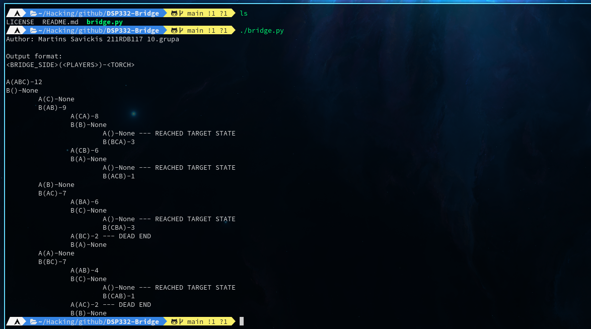

## The Torch-Bridge Problem
RTU Intro to Artificial Intelligence coding exercise. This python script does the following:
1. Creates a state space data structure;
2. Generates a graph for a specific root state;
3. Outputs the graph in ASCII;

Stud. Appl. Nr: **211RDB117**

**Output sample:**
