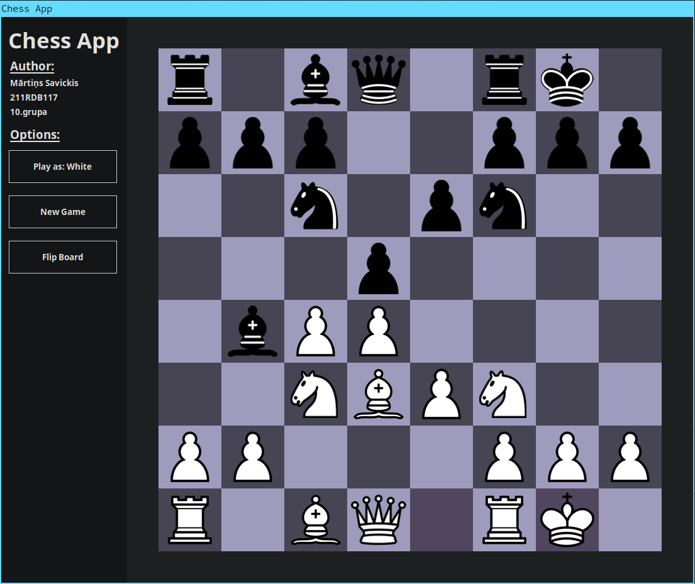

## Chess
A chess game built with Python. This was initially ment to be an RTU AI project but due to the complexity of the chess engine I had to scrap this idea.

**Preview:**

## Installation
**Packages**

Install required packages (Windows, Linux):

`` pip3 install -r requirements.txt ``

**Arch Linux**

The tkinter package is also required for Arch Linux:

`` sudo pacman -S tk ``
